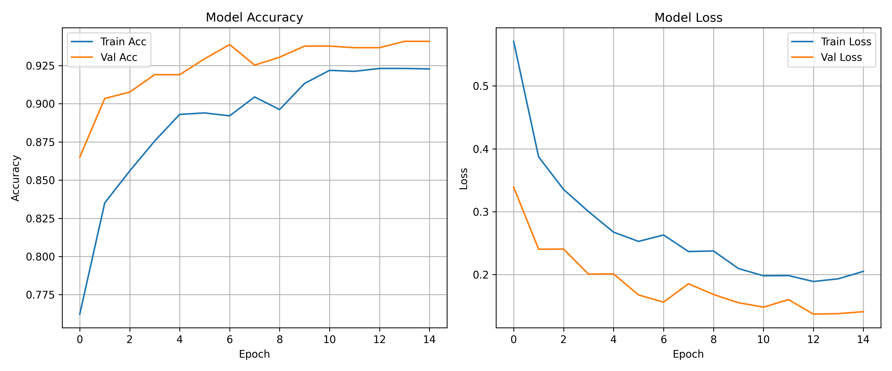
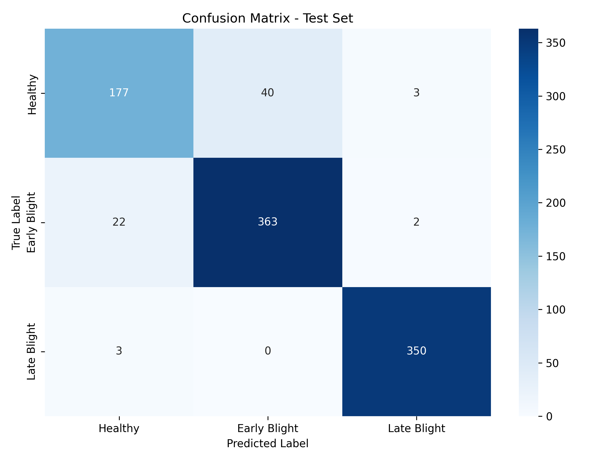
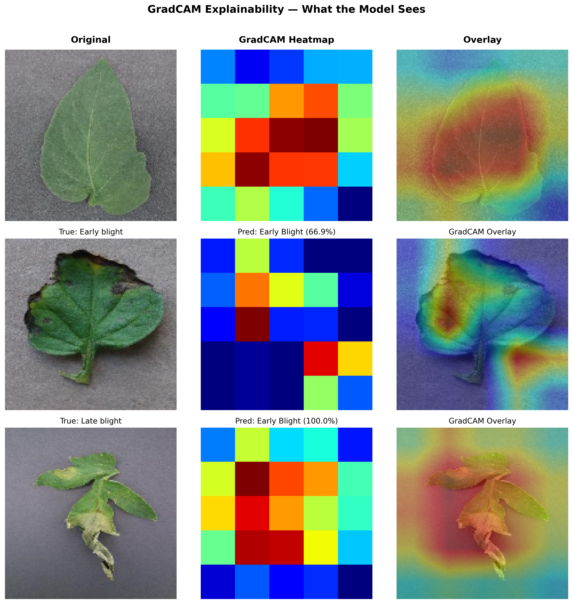
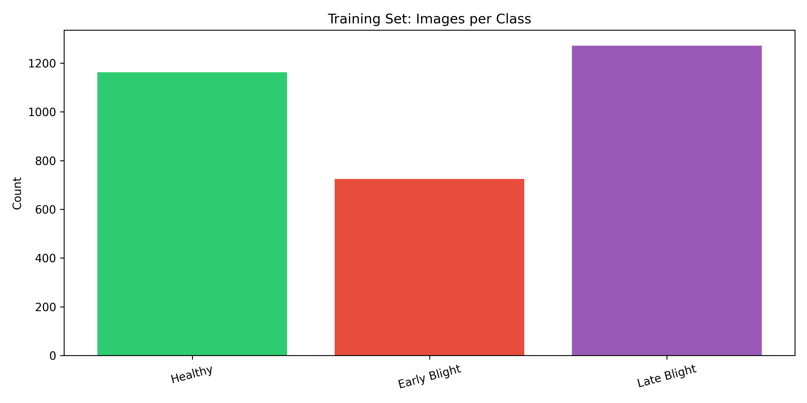

# 🍅 Tomato Leaf Disease Classifier

> A deep learning project to detect tomato leaf diseases using **MobileNetV2 + Transfer Learning**, with GradCAM explainability visualizations.

[]


---

## 📌 Overview

This project classifies tomato leaf images into **3 categories** using a fine-tuned MobileNetV2 model trained on the PlantVillage dataset.

| Class | Label |
|-------|-------|
| ✅ Healthy | `Tomato___healthy` |
| 🟡 Early Blight | `Tomato___Early_blight` |
| 🔴 Late Blight | `Tomato___Late_blight` |

---

## 🧠 Model Architecture

Input (150×150×3)
└── MobileNetV2 (pretrained on ImageNet, frozen)
└── GlobalAveragePooling2D
└── Dense(64, ReLU)
└── Dropout(0.5)
└── Dense(3, Softmax)

- **Base model:** MobileNetV2 (weights = ImageNet)
- **Fine-tuning:** Top layers trainable, base frozen
- **Optimizer:** Adam (lr=1e-3) with ReduceLROnPlateau
- **Callbacks:** EarlyStopping, ModelCheckpoint, ReduceLROnPlateau

---

## 📊 Results

| Metric | Score |
|--------|-------|
| Test Accuracy | **92.71%** |
| Test Precision | **93.09%** |
| Test Recall | **92.60%** |

### Training Curves


### Confusion Matrix


---

## 🔍 GradCAM Explainability

GradCAM (Gradient-weighted Class Activation Mapping) visualizes **which regions of the leaf the model focuses on** when making predictions.



> The heatmap highlights diseased regions in red/yellow, showing the model has genuinely learned pathological patterns — not just background noise.

---

## 🗂️ Dataset

- **Source:** [PlantVillage Tomato Dataset — Kaggle](https://www.kaggle.com/datasets/charuchaudhry/plantvillage-tomato-leaf-dataset)
- **Total images:** ~XXXX
- **Split:** 70% train / 15% val / 15% test



---

## 📁 Project Structure

tomato-leaf-disease-classifier/
├── notebooks/
│   └── tomato_leaf_disease_classifier.ipynb
├── results/
│   ├── training_curves.png
│   ├── confusion_matrix.png
│   ├── gradcam_samples.png
│   └── class_distribution.png
├── reports/
│   └── project_report.md
├── README.md
├── requirements.txt
└── .gitignore

---

## 🚀 How to Run

1. Open the notebook in Google Colab using the badge above
2. Upload your `kaggle.json` API key when prompted
3. Run all cells top to bottom

**Install dependencies locally:**
```bash
pip install -r requirements.txt
```

---

## 💾 Pretrained Model

The trained model weights (`best_model.h5`) are available here:
👉 [Download from Google Drive](https://drive.google.com/file/d/1ZU3KfAm1yN0Ka_ryg9elqiGHvlca-s8x/view?usp=sharing)

---

## 📜 License

This project is licensed under the MIT License.
